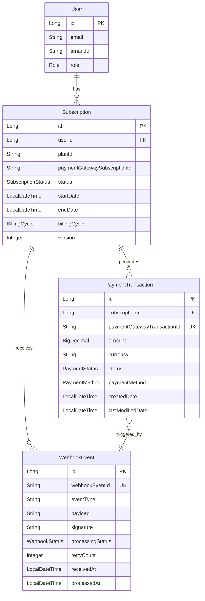
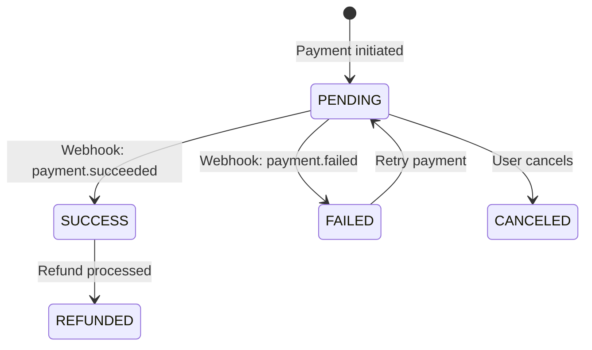
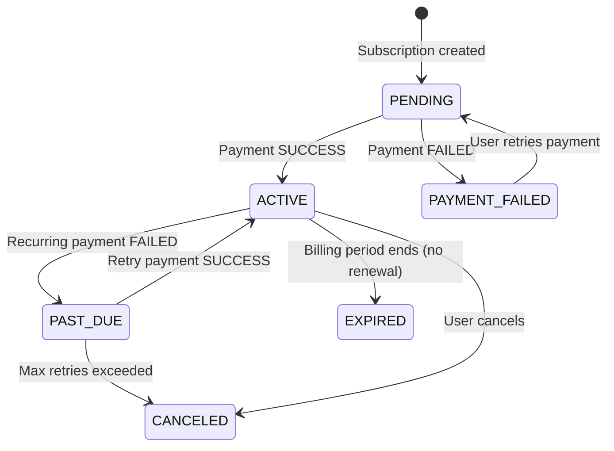

# Data Model: External Payment Integration

**Feature**: External Payment Integration  
**Branch**: `001-payment-integration`  
**Date**: 2026-01-25

## Overview

This document defines the data model for payment integration, including JPA entities, relationships, validation rules, and state transitions. All entities follow the constitutional principles of Domain-Driven Design and Data Integrity.

---

## Entity Diagram



---

## Entity Definitions

### 1. PaymentTransaction

**Purpose**: Represents a single payment attempt for a subscription, storing transaction details and status.

**Package**: `org.gb.billing.entity`

**Fields**:

| Field | Type | Constraints | Description |
|-------|------|-------------|-------------|
| `id` | `Long` | `@Id`, `@GeneratedValue` | Primary key |
| `subscriptionId` | `Long` | `@NotNull`, `@Column(nullable = false)` | Foreign key to Subscription |
| `paymentGatewayTransactionId` | `String` | `@NotNull`, `@Column(unique = true, nullable = false)` | Unique transaction ID from Stripe (idempotency key) |
| `amount` | `BigDecimal` | `@NotNull`, `@Positive`, `@Column(precision = 19, scale = 4)` | Payment amount |
| `currency` | `String` | `@NotNull`, `@Size(min = 3, max = 3)` | ISO 4217 currency code (e.g., USD, EUR) |
| `status` | `PaymentStatus` | `@Enumerated(EnumType.STRING)`, `@NotNull` | Payment status (SUCCESS, FAILED, PENDING, REFUNDED) |
| `paymentMethod` | `PaymentMethod` | `@Enumerated(EnumType.STRING)` | Payment method type (CARD, BANK_TRANSFER, WALLET) |
| `failureReason` | `String` | `@Size(max = 500)` | Reason for payment failure (if applicable) |
| `metadata` | `String` | `@Column(columnDefinition = "TEXT")` | JSON metadata from payment gateway |
| `createdDate` | `LocalDateTime` | `@CreatedDate`, `@Column(nullable = false, updatable = false)` | Timestamp when payment was created |
| `lastModifiedDate` | `LocalDateTime` | `@LastModifiedDate` | Timestamp when payment was last updated |
| `createdBy` | `String` | `@CreatedBy` | User who initiated payment |
| `lastModifiedBy` | `String` | `@LastModifiedBy` | User who last modified payment |

**Relationships**:
- `@ManyToOne(fetch = FetchType.LAZY)` to `Subscription`
- `@OneToOne(mappedBy = "paymentTransaction", cascade = CascadeType.ALL)` to `WebhookEvent`

**Indexes**:
- `@Index(name = "idx_payment_gateway_tx_id", columnList = "paymentGatewayTransactionId")` - Unique index for idempotency
- `@Index(name = "idx_subscription_id", columnList = "subscriptionId")` - Fast lookup by subscription
- `@Index(name = "idx_created_date", columnList = "createdDate")` - Efficient pagination
- `@Index(name = "idx_status", columnList = "status")` - Filter by status

**Validation Rules**:
- Amount must be positive
- Currency must be valid ISO 4217 code
- Payment gateway transaction ID must be unique across all payments
- Status transitions must follow allowed paths (see State Transitions below)

---

### 2. WebhookEvent

**Purpose**: Stores received webhook events from Stripe for audit trail and idempotency.

**Package**: `org.gb.billing.entity`

**Fields**:

| Field | Type | Constraints | Description |
|-------|------|-------------|-------------|
| `id` | `Long` | `@Id`, `@GeneratedValue` | Primary key |
| `webhookEventId` | `String` | `@NotNull`, `@Column(unique = true, nullable = false)` | Unique event ID from Stripe |
| `eventType` | `String` | `@NotNull`, `@Size(max = 100)` | Event type (e.g., payment_intent.succeeded) |
| `payload` | `String` | `@NotNull`, `@Column(columnDefinition = "TEXT")` | Full JSON payload from webhook |
| `signature` | `String` | `@NotNull`, `@Size(max = 500)` | Stripe-Signature header value |
| `processingStatus` | `WebhookStatus` | `@Enumerated(EnumType.STRING)`, `@NotNull` | Processing status (PENDING, PROCESSED, FAILED, DUPLICATE) |
| `retryCount` | `Integer` | `@Min(0)`, `@Column(nullable = false)` | Number of processing retries |
| `errorMessage` | `String` | `@Size(max = 1000)` | Error message if processing failed |
| `paymentTransactionId` | `Long` | Foreign key to PaymentTransaction (nullable for non-payment events) |
| `receivedAt` | `LocalDateTime` | `@Column(nullable = false)` | Timestamp when webhook was received |
| `processedAt` | `LocalDateTime` | Timestamp when webhook was successfully processed |

**Relationships**:
- `@OneToOne(fetch = FetchType.LAZY)` to `PaymentTransaction`

**Indexes**:
- `@Index(name = "idx_webhook_event_id", columnList = "webhookEventId")` - Unique index for idempotency
- `@Index(name = "idx_processing_status", columnList = "processingStatus")` - Find pending/failed webhooks
- `@Index(name = "idx_received_at", columnList = "receivedAt")` - Chronological queries

**Validation Rules**:
- Webhook event ID must be unique
- Retry count must be non-negative
- Processing status must transition from PENDING → PROCESSED or PENDING → FAILED

---

### 3. Subscription (Modifications)

**Purpose**: Existing entity modified to support payment gateway integration.

**Package**: `org.gb.billing.entity`

**New Fields to Add**:

| Field | Type | Constraints | Description |
|-------|------|-------------|-------------|
| `paymentGatewaySubscriptionId` | `String` | `@Column(unique = true)` | Stripe subscription ID for recurring billing |
| `paymentGatewayCustomerId` | `String` | Stripe customer ID |
| `lastPaymentDate` | `LocalDateTime` | Timestamp of last successful payment |
| `nextBillingDate` | `LocalDateTime` | Next scheduled billing date |

**Modified Fields**:
- `status`: Add new enum values: `PAST_DUE`, `PAYMENT_FAILED`

**Relationships** (new):
- `@OneToMany(mappedBy = "subscription", cascade = CascadeType.ALL, orphanRemoval = true)` to `PaymentTransaction`

**Validation Rules**:
- Payment gateway subscription ID must be unique if present
- Next billing date must be after last payment date
- Status cannot transition from CANCELED to ACTIVE without new payment

---

## Enumerations

### PaymentStatus

```java
public enum PaymentStatus {
    PENDING,        // Payment initiated but not yet processed
    SUCCESS,        // Payment successfully completed
    FAILED,         // Payment failed (card declined, insufficient funds, etc.)
    REFUNDED,       // Payment was refunded
    CANCELED        // Payment was canceled before processing
}
```

### PaymentMethod

```java
public enum PaymentMethod {
    CARD,           // Credit/debit card
    BANK_TRANSFER,  // Direct bank transfer
    WALLET,         // Digital wallet (Apple Pay, Google Pay, etc.)
    OTHER           // Other payment methods
}
```

### WebhookStatus

```java
public enum WebhookStatus {
    PENDING,        // Webhook received but not yet processed
    PROCESSED,      // Webhook successfully processed
    FAILED,         // Webhook processing failed
    DUPLICATE       // Webhook is a duplicate (idempotency check)
}
```

### SubscriptionStatus (Modifications)

```java
public enum SubscriptionStatus {
    ACTIVE,         // Subscription is active and paid
    PENDING,        // Subscription created but payment pending
    PAST_DUE,       // Payment failed but subscription not yet canceled
    PAYMENT_FAILED, // Payment failed and subscription suspended
    CANCELED,       // Subscription canceled by user or system
    EXPIRED         // Subscription expired naturally
}
```

---

## State Transitions

### PaymentTransaction State Machine



**Allowed Transitions**:
- `PENDING` → `SUCCESS`: When payment succeeds
- `PENDING` → `FAILED`: When payment fails
- `PENDING` → `CANCELED`: When user cancels before processing
- `SUCCESS` → `REFUNDED`: When refund is issued
- `FAILED` → `PENDING`: When payment is retried

**Forbidden Transitions**:
- `SUCCESS` → `FAILED`: Cannot fail after success
- `REFUNDED` → `SUCCESS`: Cannot un-refund a payment
- `CANCELED` → `SUCCESS`: Cannot succeed after cancellation

### Subscription Status Transitions (with Payment Integration)



**Business Rules**:
- Subscription becomes `ACTIVE` only after first successful payment
- Subscription moves to `PAST_DUE` if recurring payment fails (grace period)
- Subscription moves to `CANCELED` after 3 failed payment retries
- Subscription can be manually `CANCELED` by user at any time

---

## Database Schema (Flyway Migration)

**File**: `src/main/resources/db/migration/V3__create_payment_tables.sql`

```sql
-- Payment Transactions Table
CREATE TABLE payment_transactions (
    id BIGSERIAL PRIMARY KEY,
    subscription_id BIGINT NOT NULL,
    payment_gateway_transaction_id VARCHAR(255) NOT NULL UNIQUE,
    amount DECIMAL(19, 4) NOT NULL CHECK (amount > 0),
    currency VARCHAR(3) NOT NULL,
    status VARCHAR(50) NOT NULL,
    payment_method VARCHAR(50),
    failure_reason VARCHAR(500),
    metadata TEXT,
    created_date TIMESTAMP NOT NULL DEFAULT CURRENT_TIMESTAMP,
    last_modified_date TIMESTAMP,
    created_by VARCHAR(255),
    last_modified_by VARCHAR(255),
    CONSTRAINT fk_payment_subscription FOREIGN KEY (subscription_id) REFERENCES subscriptions(id) ON DELETE CASCADE
);

-- Indexes for PaymentTransaction
CREATE INDEX idx_payment_gateway_tx_id ON payment_transactions(payment_gateway_transaction_id);
CREATE INDEX idx_subscription_id ON payment_transactions(subscription_id);
CREATE INDEX idx_created_date ON payment_transactions(created_date);
CREATE INDEX idx_status ON payment_transactions(status);

-- Webhook Events Table
CREATE TABLE webhook_events (
    id BIGSERIAL PRIMARY KEY,
    webhook_event_id VARCHAR(255) NOT NULL UNIQUE,
    event_type VARCHAR(100) NOT NULL,
    payload TEXT NOT NULL,
    signature VARCHAR(500) NOT NULL,
    processing_status VARCHAR(50) NOT NULL,
    retry_count INTEGER NOT NULL DEFAULT 0 CHECK (retry_count >= 0),
    error_message VARCHAR(1000),
    payment_transaction_id BIGINT,
    received_at TIMESTAMP NOT NULL DEFAULT CURRENT_TIMESTAMP,
    processed_at TIMESTAMP,
    CONSTRAINT fk_webhook_payment FOREIGN KEY (payment_transaction_id) REFERENCES payment_transactions(id) ON DELETE SET NULL
);

-- Indexes for WebhookEvent
CREATE INDEX idx_webhook_event_id ON webhook_events(webhook_event_id);
CREATE INDEX idx_processing_status ON webhook_events(processing_status);
CREATE INDEX idx_received_at ON webhook_events(received_at);

-- Add new columns to Subscriptions table
ALTER TABLE subscriptions ADD COLUMN payment_gateway_subscription_id VARCHAR(255) UNIQUE;
ALTER TABLE subscriptions ADD COLUMN payment_gateway_customer_id VARCHAR(255);
ALTER TABLE subscriptions ADD COLUMN last_payment_date TIMESTAMP;
ALTER TABLE subscriptions ADD COLUMN next_billing_date TIMESTAMP;

-- Update subscription status enum to include new values
-- Note: Exact syntax depends on how SubscriptionStatus is currently implemented
-- If using VARCHAR, no change needed. If using ENUM, may need to recreate.
```

---

## Validation Summary

All entities follow constitutional principles:

✅ **Layered Architecture**: Entities in `entity/` package, separate from business logic  
✅ **Domain-Driven Design**: Rich domain models with behavior, value objects, and state machines  
✅ **Data Integrity**: Database constraints, JPA validation, audit fields  
✅ **Multi-Tenancy**: Payment transactions inherit tenant isolation from Subscription  
✅ **Audit Trail**: `@CreatedDate`, `@LastModifiedDate`, `@CreatedBy`, `@LastModifiedBy` on all entities

**Next Steps**: Create API contracts in `contracts/payment-api.yaml`
